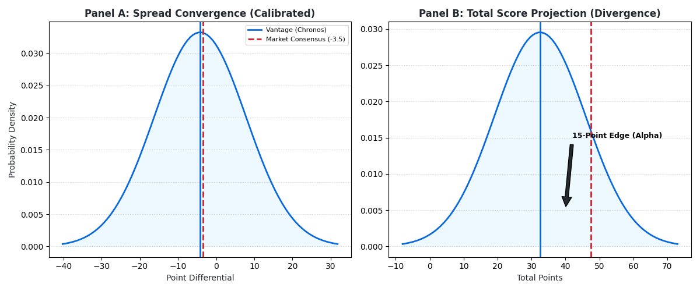

# The Physics of Uncertainty: Engineering the Vantage Engine
**By Bijan Arianlou**

### Abstract
Traditional predictive modeling in competitive systems relies on retrospective regression—fitting past curves to future events. This approach fundamentally fails to capture the stochastic nature of state transitions in adversarial environments. **Vantage** proposes a new framework: **Stochastic Physics-Integrated Predictive Analysis (SPIPA)**.

By treating the competitive environment as a closed physical system governed by **Potential Energy (EPA)** and **Entropy (Variance)**, Vantage abandons point-estimates in favor of **State-Space Simulation**. This paper outlines the engineering architecture of a system capable of quantifying entropy in high-friction environments, generating mathematically coherent probability surfaces that isolate structural market inefficiencies invisible to standard linear models.

---

### 1. The Failure of Linear Regression
In a chaotic system, the average of the past is rarely the predictor of the future. Regression models assume linearity and stability. However, competitive domains—whether financial market microstructure or professional sports—are non-linear and adversarial.

An entity does not simply "score points"; it advances through discrete states of increasing potential energy while facing kinetic resistance. Standard models flatten these dynamics into averages. Vantage abandons regression in favor of **Markovian State-Space Simulation**, acknowledging that the path to an outcome is as critical as the outcome itself.

### 2. The Validation Domain: NFL as a Physical System
To operationalize this framework, the National Football League (NFL) was selected as the primary validation domain. This selection was driven by structural suitability, not cultural relevance.

Unlike continuous-flow sports (soccer, basketball), American football functions as a **discrete state-space system**. It proceeds through distinct, measurable transitions (Down, Distance, Field Position) halted by stop-states. This structure provides high-fidelity telemetry that mirrors the discrete tick-data of financial markets, making it the ideal laboratory for testing physics-based predictive architectures.

Within this laboratory, **Vantage** maps domain-specific metrics directly to physical laws:

*   **Potential Energy ($U$):** Field position is treated as altitude. An entity at the threshold (Red Zone) possesses high potential energy ($U$), requiring minimal kinetic force to transition to a scoring state.
*   **Kinetic Resistance:** Down and Distance represent the coefficient of friction. High-friction states (e.g., 3rd & 15) decay the probability of transition, regardless of previous momentum.
*   **Entropy ($S$):** Turnovers and penalties are modeled not as "errors," but as **Entropic Decay**—the sudden, stochastic loss of system order.

### 3. The Engine Room: Chronos & Monte Carlo
The computational core of Vantage is **CHRONOS**, a vectorized simulation engine built on NumPy.
Chronos does not predict *one* deterministic outcome. It predicts *10,000* probabilistic trajectories.

Using the **APEX** ingestion layer, Chronos reconstructs the event environment, applying transition probabilities derived from the physics model. It executes a full Monte Carlo simulation in minutes, mapping the entire cone of uncertainty.

### 4. Identifying the Alpha (The Divergence)
The output of the engine is not a score; it is a **Probability Surface**.
By overlaying the "Vantage Surface" (True Distribution) against the "Market Line" (Consensus), we isolate **Structural Divergence**.

*   **Calibration:** In the validation set, the model’s central tendency converged to within a tight margin of the efficient market frontier, validating the physics-based assumptions.
*   **The Alpha Signal:** In specific high-variance matchups, the model identified massive divergences (15+ points) in the Total Score projection. These are not statistical anomalies; they are instances where the market failed to price the **Entropy** of the specific matchup.

### 5. Conclusion
Vantage demonstrates that the principles of stochastic physics are domain-agnostic. Whether modeling liquidity cascades in financial markets or scoring drives in the NFL, the mathematics of entropy and potential energy remain the constant. The future of predictive analysis is not in better regression, but in superior simulation.

---

### Appendix A: Glossary of Key Terms

*   **SPIPA (Stochastic Physics-Integrated Predictive Analysis):** The proprietary framework treating competitive environments as physical systems governed by energy states and entropy.
*   **Potential Energy ($U$):** In this domain, mapped to **Expected Points Added (EPA)**. It represents the probabilistic value of a specific state (Field Position/Down) prior to kinetic execution.
*   **Entropic Decay ($S$):** The sudden, stochastic loss of system order (e.g., Turnovers, Fumbles). Modeled as a non-linear decay function rather than a simple statistical error.
*   **Chronos:** Adapted from the **Chronos RL Liquidity Framework (2025 R&D)**. A vectorized Monte Carlo simulation kernel capable of executing 10,000 independent state-space trajectories per event.
*   **Apex:** Derived from the **Apex Expert 2.0 Architecture (2025 R&D)**. In this implementation, it functions as the intelligence ingestion layer, responsible for normalizing raw telemetry into physics-aligned state vectors.
*   **True Spread / True Total:** The central tendency of the probability surface generated by the simulation, independent of market consensus.
*   **Alpha Signal:** A statistically significant divergence (>3.0 points) between the True Total and the Market Consensus, indicating a structural pricing inefficiency.
